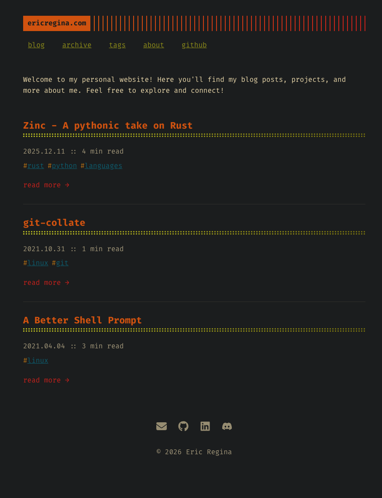

# gruv-terminus

A minimal dark theme for the [Zola](https://www.getzola.org/) static site generator. This theme was 
inspired by these sources:

* [ebkalderon/terminus](https://github.com/ebkalderon/terminus)
* [morhetz/gruvbox](https://github.com/morhetz/gruvbox)


Unlike, the original, theme colors are fixed to my specific preferences.
I would recommend forking the original theme and customizing it to your
liking if you want more flexibility.


**Try the demo now:** https://ericregina.com



## Getting Started

### Manual Installation

1. Initialize a Git repository in your [Zola project directory], if you haven't
   already:
   ```bash
   git init
   ```
2. Add the theme as a Git submodule:
   ```
   git submodule add https://github.com/ebkalderon/terminus.git themes/terminus
   ```
3. Enable the theme in your `config.toml`:
   ```toml
   theme = "terminus"
   ```
4. Set a website `title` in your  `config.toml`:
   ```toml
   title = "Your Site Title"
   ```
5. Create a text file named `content/_index.md`. This file controls how your
   home page looks and behaves. Choose _exactly one_ of the following options:
   1. **Serve blog posts from `/`:**
      ```markdown
      +++
      title = "Home"
      paginate_by = 5  # Show 5 posts per page.
      +++
      ```
   2. **Serve posts from a different path, e.g. `blog/`:**
      ```markdown
      +++
      title = "Home"

      [extra]
      section_path = "blog/_index.md"  # Where to find your posts.
      max_posts = 5  # Show 5 posts and a link to blog section on home page.
      +++
      ```

[Zola project directory]: https://www.getzola.org/documentation/getting-started/cli-usage/#init

### Updating gruv-terminus

To update the gruv-terminus theme as a Git submodule, run:

```bash
git submodule update --remote themes/gruv-terminus
```

## License

This project is licensed under the terms of the [MIT license](./LICENSE).
