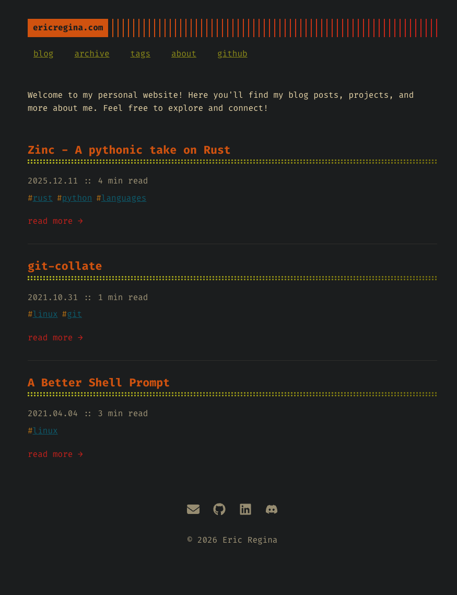

# gruv-terminus

A minimal, opinionated dark theme for the [Zola](https://www.getzola.org/) static site generator, built on the [Gruvbox](https://github.com/morhetz/gruvbox) color palette and inspired by [ebkalderon/terminus](https://github.com/ebkalderon/terminus).

**Try the demo:** https://ericregina.com



## ✨ Features

- 🎨 **Gruvbox Dark** color scheme with warm, easy-on-the-eyes tones
- 📝 **Syntax highlighting** using the built-in Zola Gruvbox Dark theme
- ➕ **KaTeX math rendering** — enable per-page or globally via `config.toml`
- 💬 **Giscus comments** backed by GitHub Discussions — fully configurable, opt-out per page
- 📋 **Copy-to-clipboard** button on all code blocks
- 🏷️ **Tags and categories** taxonomies with feeds
- 📡 **RSS/Atom feeds** generated automatically
- 🖼️ **Responsive images** via the `responsive_image` shortcode with `srcset` support
- 🔣 **GitHub-style alerts** — `[!NOTE]`, `[!WARNING]`, `[!TIP]`, etc.
- 🔒 **Content Security Policy** headers — configurable, with automatic handling for dev mode
- 📱 **Responsive layout** with mobile-friendly navigation
- 🔗 **Anchor links** on headings
- 🦶 **Bottom footnotes** in GitHub style with back-references
- ⚡ **No external dependencies** — all fonts and assets are self-hosted

## 🚀 Getting Started

### Installation

1. Initialize a Git repository in your [Zola project directory], if you haven't already:
   ```bash
   git init
   ```

2. Add the theme as a Git submodule:
   ```bash
   git submodule add https://github.com/ericreg/gruv-terminus.git themes/gruv-terminus
   ```

3. Enable the theme in your `config.toml`:
   ```toml
   theme = "gruv-terminus"
   ```

4. Set a `title` in your `config.toml`:
   ```toml
   title = "Your Site Title"
   ```

5. Create `content/_index.md`. Choose one of:

   **Serve posts directly from `/`:**
   ```toml
   +++
   title = "Home"
   paginate_by = 5
   +++
   ```

   **Serve posts from a sub-path (e.g. `blog/`):**
   ```toml
   +++
   title = "Home"

   [extra]
   section_path = "blog/_index.md"
   max_posts = 5
   +++
   ```

[Zola project directory]: https://www.getzola.org/documentation/getting-started/cli-usage/#init

### Updating

```bash
git submodule update --remote themes/gruv-terminus
```

## ⚙️ Configuration

All theme options live under `[extra]` in your `config.toml`. See the annotated [`config.toml`](config.toml) in this repo for the full reference. Key options:

| Option | Default | Description |
|---|---|---|
| `layout` | `"center"` | Page layout: `"left"`, `"center"`, or `"full-width"` |
| `copy_button` | `true` | Copy-to-clipboard button on code blocks |
| `katex` | `false` | Enable KaTeX math rendering globally |
| `favicon_emoji` | — | Emoji to use as favicon |
| `show_default_author` | `false` | Show the site author on every post |
| `main_menu` | `[]` | Navigation links in the header |
| `socials` | `[]` | Social icon links in the footer |

### 💬 Giscus Comments

Comments are powered by [giscus](https://giscus.app), which stores discussions in GitHub Discussions. To enable:

1. Enable Discussions on your GitHub repo (Settings → Features → Discussions)
2. Install the [giscus app](https://github.com/apps/giscus) on your repo
3. Visit [giscus.app](https://giscus.app) to generate your `repo_id` and `category_id`
4. Add to your `config.toml`:

```toml
[extra.giscus]
enabled = true
repo = "owner/repo"
repo_id = "..."
category = "General"
category_id = "..."
mapping = "pathname"
theme = "gruvbox_dark"  # or "css/giscus-theme.css" for a custom theme
```

To disable comments on a specific page, add to its frontmatter:
```toml
[extra]
comments = false
```

### 🖼️ Responsive Images

Use the `responsive_image` shortcode to serve appropriately sized images:

```
{{/* responsive_image(path="image.jpg", alt="Description") */}}
```

Configure breakpoint widths in `config.toml`:
```toml
[extra.responsive_images]
widths = [640, 784, 1280, 1920, 2560]
fallback_width = 1280
```

### ➕ KaTeX Math

Enable KaTeX globally or per-page:

```toml
# config.toml
[extra]
katex = true

# or in page frontmatter
[extra]
katex = true
```

Then write inline math with `$...$` or display math with `$$...$$`.

## 📄 License

This project is licensed under the terms of the [MIT license](./LICENSE).
